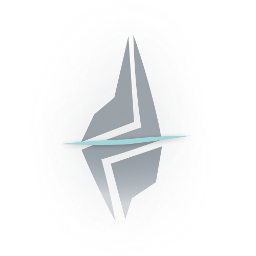

<div align="center">
  
  <h1>Hattic</h1>
  <p><strong>Защитный интеллект для современных сетей.</strong></p>

  <p>
    <a href="https://github.com/DELMEERs/hattic/actions/workflows/release.yml">
      
    </a>
    <a href="https://github.com/DELMEERs/hattic/releases">
      
    </a>
    <a href="LICENSE">
      
    </a>
    <br>
    
    
  </p>
</div>

---

## 🛡️ Суть Hattic

**Hattic** — это высокопроизводительный кроссплатформенный сетевой сниффер и система обнаружения вторжений (IDS), созданная для ясности и скорости. Объединяя низкоуровневую точность **Go** с плавной интерактивностью **Vue.js**, Hattic предоставляет «стеклянный» взгляд на саму душу вашей сети.

Будь вы исследователем безопасности, системным администратором или разработчиком, отлаживающим микросервисы, Hattic предлагает изысканную среду для захвата, анализа и защиты вашего трафика без перегруженности традиционных корпоративных инструментов.

## ✨ Премиальные возможности

-   🔍 **Анализ в реальном времени** – Глубокая инспекция сетевого трафика с задержкой менее миллисекунды.
-   🧠 **Smart Guard (Проверка зависимостей)** – Интеллектуальное автоопределение `Npcap` (Windows) или `libpcap` (Linux). Движок запустится только тогда, когда среда полностью готова.
-   📊 **Единый дашборд** – Элегантный интерфейс на базе Vite и Tailwind CSS для визуализации всплесков трафика и распределения протоколов.
-   🪶 **Легковесность** – Минимальное потребление CPU и памяти, оптимизированное для фонового мониторинга.
-   🚨 **Обнаружение вторжений** – Встроенные анализаторы для выявления ARP-спуфинга, сканирования портов и флуд-атак.

---

## 🚀 Установка и настройка

Hattic распространяется в виде портативного бинарного файла. Выберите вашу платформу для безупречной настройки.

### 🪟 Windows
1.  **Загрузка:** Возьмите последний `.exe` со страницы [Releases](https://github.com/DELMEERs/hattic/releases).
2.  **Требование драйвера:** Для работы Hattic необходим **Npcap**.
    -   [Скачать Npcap можно здесь](https://npcap.com/#download).
    -   **Важно:** Во время установки **обязательно** отметьте галочку **"Install Npcap with WinPcap compatibility mode"**, иначе движок сниффера не сможет функционировать.
3.  **Запуск:** Запустите `hattic.exe` и предоставьте права администратора при появлении запроса.

### 🐧 Linux
1.  **Загрузка:** Скачайте бинарный файл со страницы [Releases](https://github.com/DELMEERs/hattic/releases).
2.  **Права доступа:** Чтобы захватывать пакеты без запуска всего интерфейса от имени root (настоятельно рекомендуется), выполните следующую команду:
    ```bash
    sudo setcap cap_net_raw,cap_net_admin=eip ./hattic
    ```
    *Это даст бинарному файлу специфические сетевые привилегии, сохраняя безопасность среды выполнения.*
3.  **Запуск:** `./hattic`

---

## 🛠️ Технологический стек

Hattic построен на базе современной типобезопасной архитектуры.

| Слой | Технологии |
| :--- | :--- |
| **Frontend** | [Vue 3](https://vuejs.org/), [Vite](https://vitejs.dev/), [Tailwind CSS](https://tailwindcss.com/), [Lucide Icons](https://lucide.dev/) |
| **Backend** | [Go 1.22+](https://go.dev/), [gopacket](https://github.com/google/gopacket), [Wails v2](https://wails.io/) |
| **Infrastructure** | GitHub Actions (CI/CD) |

---

## 🔮 Будущее проекта

Мы постоянно развиваемся. Вот наш стратегический план:

-   [x] **Начальная разработка ядра на Go** – Высококонкурентный движок обработки пакетов.
-   [x] **Кроссплатформенный CI/CD пайплайн** – Автоматическая сборка для Windows и Linux.
-   [x] **Интеллектуальный контроль зависимостей** – Надежная обработка сред Npcap/libpcap.
-   [ ] **CLI/TUI версия** – Выделенный терминальный интерфейс для продвинутых пользователей и удаленных SSH-сессий.
-   [ ] **REST/gRPC API** – Режим «headless» для интеграции с внешними стеками мониторинга (ELK, Grafana).

---

## 🤝 Участие и Лицензия

Hattic — это Open Source проект. Мы приветствуем вклад, который соответствует нашему видению высокопроизводительной сетевой безопасности.

-   **Лицензия:** Распространяется под [MIT License](LICENSE).
-   **Безопасность:** Чтобы сообщить об уязвимости, пожалуйста, откройте приватный GitHub Advisory.

<div align="center">
  <p>Разработано с ❤️ диланом экстримом</p>
  <a href="https://github.com/DELMEERs/hattic/stargazers">⭐ Поставить звезду на GitHub</a>
</div>

---

<div align="center">
  <p><b>Language / Язык</b></p>
  <a href="#hattic">English Version</a> •
  <a href="#hattic-1">Русская версия</a>
</div>